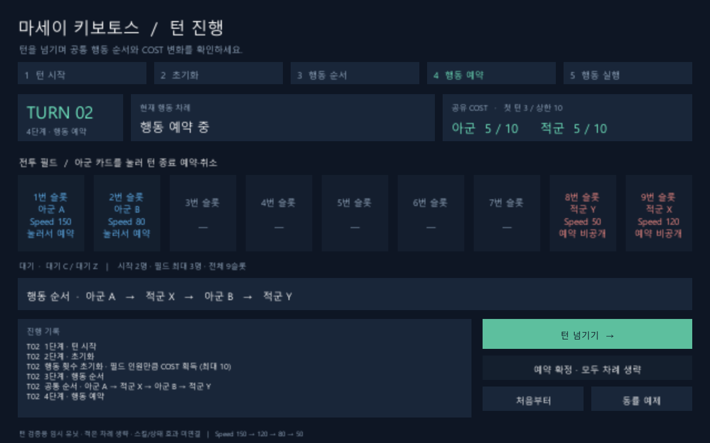

# 마키보 턴 진행과 턴 넘기기

2026-09-30 · 상태: **검토 대기** · 검토자: dayoff53

## 목적과 규칙

새 마키보 턴제의 실제 진행을 화면에서 확인하고 턴을 넘길 수 있게 한다. 카브 격리 코드는 다시 연결하지 않았다. 관련 원문은 1절(구성·능력치), 2절(PvE 퇴각/종료), 3~9절(전체 턴·개별 차례·5단계·예약·실행)이다.

이번 제출은 **턴 종료만 예약하는 2세력 PvE 기반 구현**이다. 임시 유닛은 공격하지 않는다. 실제 캐릭터의 밸런스 데이터, 스킬/피해/BP, 이동, 교체, EX, 아이템, 상태 효과/쿨다운과 AI 정책을 구현했다고 표시하지 않는다. M1과 M2의 전체 범위 완료도 아니다.

## 실행과 확인 순서

1. Unity 6000.5.10f1에서 [TurnSandbox.unity](../../Assets/MaseiKivotos/Scenes/TurnSandbox.unity)를 열고 Play를 누른다. 메뉴 **마키보 → 턴 검증 씬 열기**로도 열 수 있다. 기존 LoadingScene이나 카브 전투 씬을 거치지 않는다.
2. `TURN 01`, `4단계 · 행동 예약`, 양측 `COST 3 / 10`을 확인한다. 첫 1~3단계를 처리한 로그가 남아 있다.
3. 공통 순서가 **아군 A → 적군 X → 아군 B → 적군 Y**인지 확인한다. 아군 A/B는 1/2번, 적군 X/Y는 9/8번 슬롯이며 C/Z는 대기다.
4. 아군 카드를 누르면 그 유닛의 턴 종료 예약을 넣거나 취소할 수 있다. 상대 예약 내용은 화면에 표시하지 않는다.
5. **예약 확정 · 모두 차례 생략**을 누르면 미예약 유닛도 턴 종료로 예약하여 확정한다. **다음 단계 / 차례**를 누르면 행동 시작과 턴 종료를 한 번씩 나누어 확인한다. A의 차례가 끝나도 전체 턴은 여전히 1턴이다.
6. **턴 넘기기**를 누르면 남은 확정 차례를 순서대로 처리한 뒤 다음 턴의 예약 단계에서 멈춘다. `TURN 02`, 양측 `COST 5 / 10`을 확인한다. 버튼은 처리 중 비활성화되어 중복 실행되지 않는다.
7. 반복하면 COST가 `3 → 5 → 7 → 9 → 10 → 10`으로 변한다. 빠른 유닛도 느린 유닛도 전체 턴마다 기본 차례는 한 번이다.
8. **동률 예제**로 처음부터 시작하면 모두 Speed 100이다. 매 턴 새로 추첨한다. 우연히 이전 턴과 같은 순서가 나올 수 있으며, 같은 결과 자체는 실패가 아니다. **처음부터**는 진행 중인 자동 넘기기도 취소하고 TURN 01/COST 3으로 되돌린다.

검증 화면은 1280×800 기준의 반응형 CanvasScaler를 사용한다. `턴 넘기기`는 턴 번호를 직접 증가시키거나 AP 시간을 빠르게 감는 기능이 아니다. 예약 확정→각 유닛의 차례→전체 턴 완료→다음 초기화를 같은 규칙 API로 실행한다.

## 구성과 구현 경계

| 경로 | 책임 |
| --- | --- |
| [Core/BattleRoster.cs](../../Assets/MaseiKivotos/Core/BattleRoster.cs) | 6종 능력치, 안정적인 유닛 ID, 편성/출전 구역, 필드·대기·퇴각 구분, 난수 공급 |
| [Core/TurnBattle.cs](../../Assets/MaseiKivotos/Core/TurnBattle.cs) | Unity 독립 5단계 턴, Speed 내림차순/동률 Fisher-Yates, 턴 종료 예약·확정, COST, 차례 처리와 진행 기록 |
| [Unity/TurnSandboxController.cs](../../Assets/MaseiKivotos/Unity/TurnSandboxController.cs) | 개발용 편성, 버튼 명령, 순차 자동 진행, 중복 입력/초기화 보호 |
| [Unity/TurnSandboxView.cs](../../Assets/MaseiKivotos/Unity/TurnSandboxView.cs) | 9슬롯, 전체 턴·개별 차례·단계·COST·행동 순서·로그 표시 |
| [Editor/TurnSandboxScene.cs](../../Assets/MaseiKivotos/Editor/TurnSandboxScene.cs) | 독립 씬 최초 생성과 열기 메뉴. 기존 씬을 덮어쓰거나 BuildSettings를 변경하지 않음 |
| [EditMode 테스트](../../Assets/MaseiKivotos/Tests/EditMode/TurnBattleTests.cs) | 규칙·경계·예약 불변·동률 난수·퇴각/종료 검증 |
| [PlayMode 테스트](../../Assets/MaseiKivotos/Tests/PlayMode/TurnSandboxTests.cs) | 실제 저장 씬 로드, UI raycast/클릭, 턴/표시/COST, 중복 넘기기와 리셋 검증 |

Core 어셈블리는 `noEngineReferences`로 Unity 참조를 금지한다. 새 코드는 카브와 이름/어셈블리를 공유하지 않는다. 신규 파일은 각각 새 GUID를 사용한다. 기존 씬·프리팹·ScriptableObject·폰트·플러그인은 이 기능의 구현 원본으로 수정하지 않았다.

편성은 이번 입력 계약에서 세력당 2~6명으로 제한하고 앞의 2명을 각 출전 구역에 배치한다. 1명 편성 허용 여부를 새 게임 규칙으로 확정한 것은 아니다. 필드 최대 3명을 넘기는 배치 API는 아직 없다. 서브 기본 횟수와 행동 횟수 초기화는 보관하지만 스킬/서브 행동 자체는 아직 실행하지 않는다.

상태 효과/쿨다운이 없는 현재 예제에서도 첫 턴 초기화 단계는 실행하며 COST 획득만 생략한다. 효과 처리는 후속 기능으로 연결해야 한다. `ApplyCompletedRetreatBatch`는 필수 후속 효과까지 끝난 판정 묶음을 전달받는 경계이며 피해 계산기가 아니다. 필드 전멸 시 대기가 남아도 끝나며 PvE 동시 전멸은 패배다. 화면의 임시 유닛은 공격하지 않으므로 이 종료 경계는 규칙 테스트로 검증한다.

## 검증 결과

| 항목 | 실제 확인 결과 |
| --- | --- |
| Unity 컴파일 | 6000.5.10f1에서 새 Core/Unity/Editor/테스트 어셈블리를 컴파일하고 독립 씬 생성. C# 오류 없음 |
| EditMode | **12개 통과, 실패 0개**. 초기 배치/첫 턴/5단계/Speed/동률 재추첨/COST 상한/예약 불변/퇴각/PvE 종료/입력 검증 |
| PlayMode | **1개 통과, 실패 0개**. 저장한 씬을 로드하여 UI raycast와 Button의 pointer-click 경로로 조작. TURN 01→02, COST 3→5, 행동 4회, 중복 진행 방지, 진행 중 리셋 확인 |
| 화면 | 실제 uGUI Canvas를 렌더링하여 1턴/2턴 PNG 캡처. 글자·슬롯·버튼·턴/COST 표시 확인 |
| 카브 보존 | 격리 코드 49쌍과 기존 Assets 파일 3,978개 해시 일치, 남은 새/기존 C#에서 격리 타입 참조 없음 |
| 플레이어 빌드 | 미실행. 기존 BuildSettings를 변경하지 않음 |

신규 에셋의 `.meta` 누락과 GUID 충돌 없음, 문서 로컬 링크 240개와 신규 소스의 공백/문자 검사 통과. 기존 사용자 프리팹/씬의 공백 경고는 보존하여 정리하지 않았다.

테스트 명령: Unity를 닫고 저장소 루트에서 `& ./Tools/Test-MakiboTurns.ps1`. 개별 실행은 `-Platform EditMode` 또는 `-Platform PlayMode`다. 각 실행은 고유 XML과 로그를 `Logs`에 남기며 테스트 0개를 성공으로 간주하지 않는다. [테스트별 결과와 원본 XML 해시](evidence/2026-09-30-turn-tests.json)를 보존했다.

실행 중 기존 Odin/Sirenix 에디터 초기화의 `MissingFieldException`은 계속 보고된다. 테스트 실패나 새 C# 컴파일 오류와는 구분하며, 에디터 전체가 오류 없이 동작한다고 주장하지 않는다. 기존 연출/도구 코드의 경고도 이번에 정리하지 않았다. Unity가 자동 갱신한 기존 ProjectSettings/자동 생성 솔루션 변경은 작업 시작 상태로 되돌렸다.

## 남은 작업과 미정 규칙

- 상태/쿨다운, 일반 스킬/BP/피해, 이동/교체, EX/서포트/아이템은 이 턴 상태기에 별도 실행기로 연결해야 한다. 지금은 `턴 종료`만 예약 가능한 범위다.
- 턴 도중 Speed 변경 API는 아직 제공하지 않는다. C-001의 재추첨 범위를 임의로 확정하지 않았다. 턴 시작 동률 재추첨은 구현했다.
- Q-001~Q-006 및 C-002~C-009의 게임 규칙 결정은 변경하지 않았다. PvP·다세력·실제 적 AI도 이번 구현 범위 밖이다.
- 보존한 Odin/Sirenix 에디터 초기화 예외는 이전 격리 작업에서 확인된 별도 기술 문제다. 이 턴 화면은 해당 API를 사용하지 않는다.
- 기존 게임 메뉴와 빌드 시작 씬은 아직 새 전투로 전환하지 않았다. 이 씬을 직접 열어 검토한다.

## 검토 결과

dayoff53의 검토 전. 실제 피드백을 받은 뒤 기록한다.
