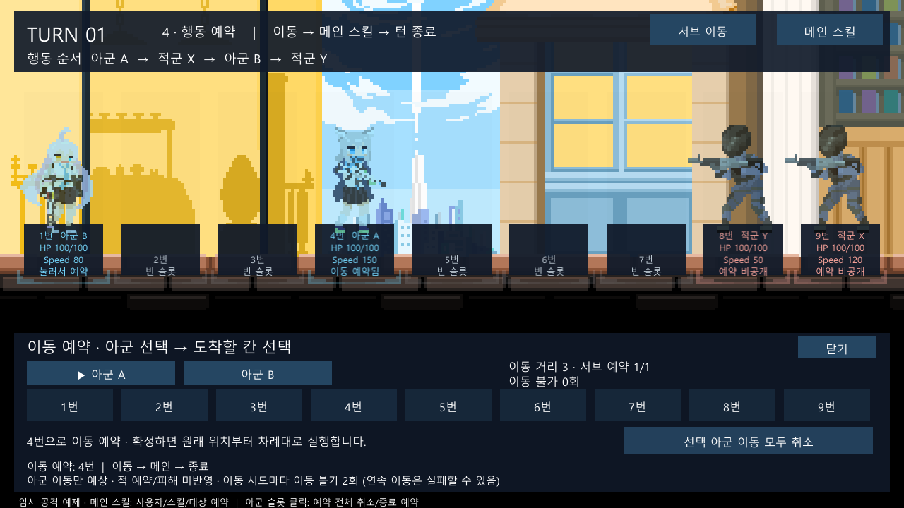
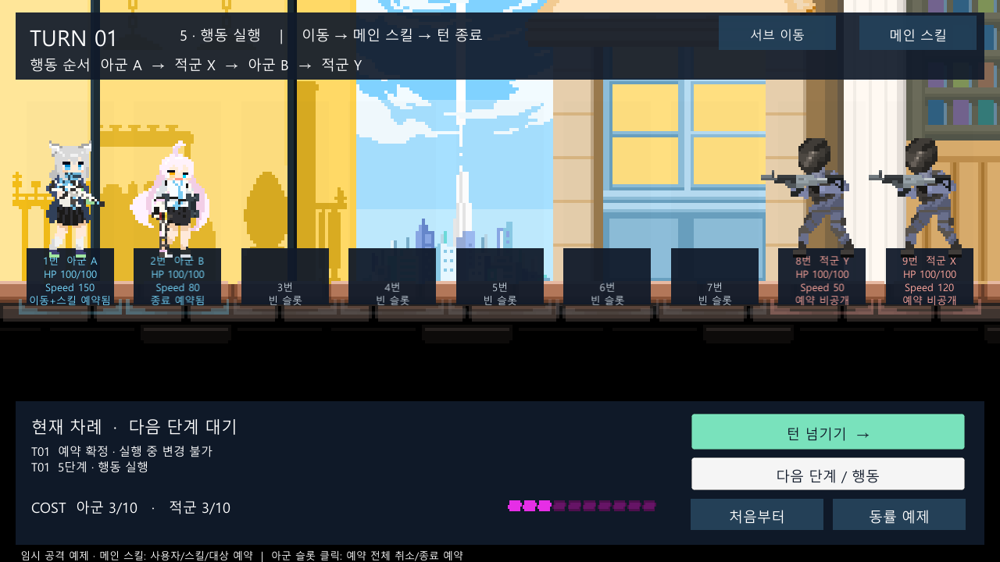
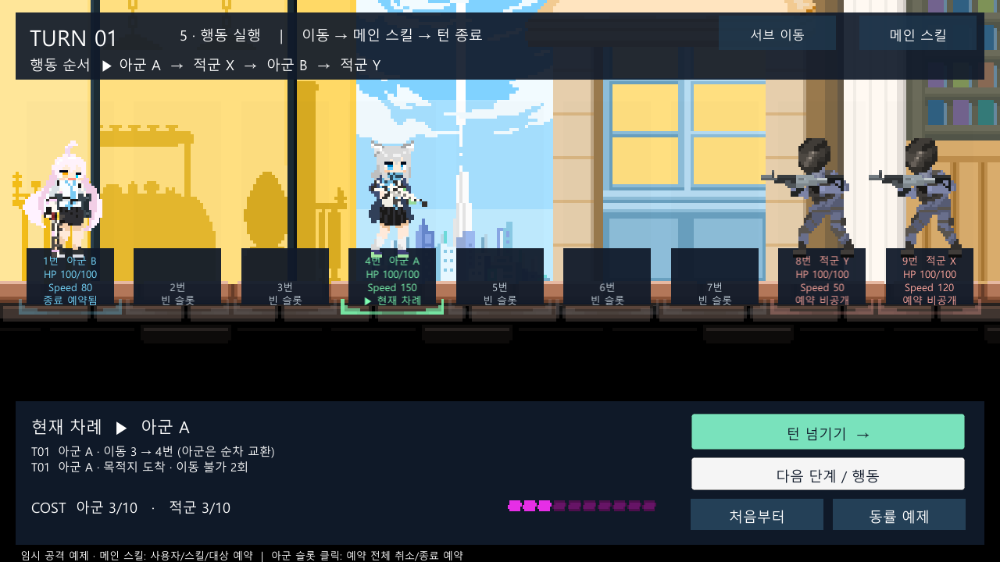

# 서브 이동과 4단계 미리보기

2026-10-02 / 상태: **검토 대기** / 검토자: dayoff53

후속 변경: 2026-10-04 **D-009**에 따라 이동 금지 중 재시도는 디버프를 재부여하지 않는다. 아래 최초 구현의 “다시 2회” 설명보다 [최신 변경 기록](2026-10-04-movement-lock-retry.md)을 우선한다.

## 목적과 근거

서브 행동인 이동을 추가하고, 예약 단계에서 캐릭터가 이동한 예상 배치를 보여 준다. 예약을 확정하면 예시 이미지를 제거하고 원래 좌표에서 차례대로 실제 행동을 실행한다. 사용자 요구는 [D-008](../DECISIONS.md)에 기록했다. 전투 규칙은 [원문](../reference/battle-rules-2026-09-23.txt) 8절(535행), 9절(597행), 14절(1258행)을 적용했다.

## 동작

1. **서브 이동 → 아군 → 목적지**로 이동을 추가한다. 이동 횟수는 남은 서브 범위이며 메인 스킬과 함께 또는 이동만 예약할 수 있다.
2. 4단계에서 별도 파란 캐릭터 이미지가 예상 배치로 바뀐다. 아군의 이전 차례와 순차 교환을 반영한다. 원래 좌표, HP/BP/COST, 실제 서브 잔여량, 이동 불가 횟수는 바뀌지 않는다.
3. **닫기 → 예약 확정**을 누르면 5단계가 시작된다. 예시 이미지가 사라지고 실제 시작 배치가 다시 표시된다. 아직 이동한 것은 아니다.
4. **다음 단계 / 행동**으로 차례 시작 후 한 칸씩 이동한다. 아군을 만나면 각 칸에서 자리를 교환한다. **턴 넘기기**는 같은 과정을 간격을 두고 자동 진행한다.
5. 이동 종료 후 메인 스킬, 마지막 턴 종료를 실행한다. 스킬의 대상은 ID로 추적하고 이동 후 실제 좌표로 사거리를 다시 검사한다.

예약 시 보이는 적을 목적지로 삼거나 통과할 수 없다. 비공개 적 이동으로 실행 시 경로가 새로 막히면 적 바로 전까지 이동한다. 바로 앞이 적이면 움직이지 못한다. 이동 시도마다 성공·실패·부분 이동 여부와 무관하게 서브 1회를 소비하고 이동 불가 2회를 받는다. 교환당한 아군에는 이 이유로 이동 불가를 주지 않는다.

이동 불가는 자기 차례의 마지막 종료에서만 1 감소한다. 획득 차례 종료 후 1, 다음 차례 종료 후 0이다. 추가 이동을 예약해도 앞선 시도로 이동 불가가 생기면 다음 시도는 실패하고 다시 2회를 받는다. 메인 행동 금지와 이동 금지는 별도로 판정한다.

## 미리보기의 범위

미리보기는 아군 이동만 반영한 예상이다. 적 예약·스킬 피해·퇴각 등 아직 실행하지 않은 결과는 반영하지 않으며, 실제 실행에서는 조건을 다시 판정한다. 화면에서도 이 제한을 표시한다. 스킬 선택의 사거리 안내는 선택 유닛의 **자기 메인 직전** 예상 위치를 사용한다. 더 느린 아군이 이후 교환할 위치로 사거리를 잘못 안내하지 않는다.

이동 취소는 이동 목록만 비우고 스킬과 종료를 유지한다. 슬롯 클릭의 전체 취소 또는 메인 창의 **모든 행동 취소 · 종료만 예약**은 이동까지 비운다. 미리보기에서 이동한 캐릭터를 누르면 화면에 표시된 유닛을 선택한다.

## 코드 역할

| 파일 | 책임 |
| --- | --- |
| [BattleRoster.cs](../../Assets/MaseiKivotos/Core/BattleRoster.cs) | 정의의 `MoveRange`, 전투 중 `MovementLockTurns`와 `IsMovementBlocked` |
| [TurnBattle.Movement.cs](../../Assets/MaseiKivotos/Core/TurnBattle.Movement.cs) | 이동 목록·예약 검사·복사본 예측·한 칸 실행·교환·완료 상태 |
| [TurnBattle.cs](../../Assets/MaseiKivotos/Core/TurnBattle.cs) | 이동→메인→종료 순서, 자기 종료의 이동 불가 감소, 턴/퇴각/전투 종료 정리 |
| [TurnSandboxController.cs](../../Assets/MaseiKivotos/Unity/TurnSandboxController.cs) | 두 씬 공용 명령, 표시 좌표 선택, 미리보기 갱신/제거, 예약 수에 따른 자동 진행 상한 |
| [MovementPanel.cs](../../Assets/MaseiKivotos/Unity/MovementPanel.cs) | 필드를 가리지 않는 하단 이동 창, 아군/목적지/취소, 서브 및 이동 불가 안내 |
| [StageBattleView.cs](../../Assets/MaseiKivotos/Unity/StageBattleView.cs) | 기존 스프라이트를 쓰는 별도 예시 렌더러와 실제 좌표 표시 |
| [TurnSandboxView.cs](../../Assets/MaseiKivotos/Unity/TurnSandboxView.cs) | 독립 검증 화면의 예상 카드 배치와 실제 배치 전환 |
| [MainSkillPanel.cs](../../Assets/MaseiKivotos/Unity/MainSkillPanel.cs) | 이동 후 예상 사거리 안내와 상호 배타적인 예약 창 |

새 파일과 추가 필드/함수에는 한국어 역할 주석을 작성했다. 새 `.meta`를 함께 제공한다. 씬/프리팹/스프라이트 등 비스크립트 리소스를 폐기하거나 편집하지 않았다. 시작 시 이미 변경되어 있던 사용자 씬과 SceneTemplate은 유지한다.

## 검증

- EditMode: **63/63 통과**. 기존 45개와 이동 18개. 미리보기 상태/난수/로그 보존, 한 칸 교환, 이동→메인→종료, 실패/부분 이동, 예약 상한과 취소, 금지 상태 분리, 퇴각 정리, 실행 사거리 재검사를 포함한다.
- PlayMode: **6/6 통과**. 기존 스킬/헤일로/턴 진행을 포함해 이동 미리보기, 취소, 확정 시 제거, 한 칸 실행, 스킬 연결, 표시 좌표 클릭, 실행 중 초기화를 실제 UI raycast/클릭으로 확인했다. 독립 TurnSandbox의 이동 선택도 포함한다.
- 원본 에디터의 사용자 편집을 보존하기 위해 `Logs/StageValidation` 사본에서 Unity `6000.5.10f1`로 실행한다. 플레이어 빌드는 실행하지 않는다.
- 최초 PlayMode는 5/6이었다. 새 클릭 테스트가 씬 로드 직후 `LateUpdate`의 슬롯 UI 정렬보다 먼저 클릭했다. 한 프레임을 기다리도록 테스트를 보완한 뒤 전체 6개를 재실행해 통과했다.
- 최종 EditMode `Logs/movement-editmode-final.xml`, PlayMode `Logs/movement-playmode-reviewed.xml`; 대응 `.log` 파일에 실행 기록이 있다. [결과·해시 요약](evidence/2026-10-02-movement-tests.json).
- 마키보 소스/메타/씬 등 59개는 검증 사본과 해시 일치. 사용자 Stage_Battle 씬과 SceneTemplate은 이번 작업 시작 백업과 각각 해시가 같다. Packages와 ProjectSettings도 비교했으며 사본의 `ProjectSettings.asset`만 기존 Unity 자동 이행(직렬화 28→29 등) 차이가 남는다. [기존 설정 차이](evidence/2026-10-02-validation-settings-diff.json). 원본 설정은 변경하지 않았다.
- 최종 PlayMode 후 수정은 `TurnBattle.cs`의 설명 주석 위치뿐이며 최종 EditMode에서 컴파일/63개를 재확인했다. 실행 로직과 UI는 PlayMode 통과본과 같다.
- 기존 Sirenix/Odin `GUITimeHelper.Init` / `ImguiElementUtils.Init` 초기화 예외 및 보존된 Missing Script 경고는 남는다. 새 마키보 C# 컴파일 오류는 없었다.
- 변경한 코드/문서는 `git diff --check` 통과. 저장소 전체 검사는 기존 사용자 씬의 Unity 직렬화 빈 값 줄 공백을 지적하므로 해당 리소스를 정리하지 않았다.

### 실제 씬 이미지

4단계: 실제 A1/B2 상태를 유지하며 파란 예시 이미지로 A4/B1을 표시한다.

5단계 시작: 예시 이미지를 없애고 원래 A1/B2부터 실행을 준비한다.

실제 이동 종료: A가 한 칸씩 이동해 4번에 도착했고 B는 1번으로 교환되었다. 다음 진행은 메인 스킬이다.

## dayoff53 확인 순서

1. `Stage_Battle`을 열고 Play한다. **서브 이동 → 아군 A → 4번**을 누른다.
2. A는 파란 예시로 4번, B는 교환된 1번에 보이는지 확인한다. 이동 창은 하단에 있어 필드가 보인다.
3. **선택 아군 이동 모두 취소**를 누르면 처음 배치가 돌아오는지 확인하고 다시 A→4번을 예약한다.
4. 닫은 뒤 메인 스킬에서 A의 기본 사격→적 X를 예약한다.
5. **예약 확정**을 한 번 누르면 예시가 사라지고 A1/B2 실제 배치로 돌아오는지 확인한다.
6. **다음 단계 / 행동**으로 A 차례 시작 → A2/B1 → A3 → A4 → X 피해 → A 종료 순서를 확인한다.
7. **턴 넘기기**로 다음 예약에 도달해 이동 창에서 A의 이동 불가 1회를 확인한다. 다음 차례에 이동을 생략하고 종료하면 그다음 턴에는 0회다.
8. **처음부터**로 원래 배치·횟수·예약이 초기화되는지 확인한다.

## 남은 범위

- 예제 유닛의 이동 거리 3칸, 편성/공격 수치는 임시다. 기존 `UnitDefinition` 호출은 `moveRange` 생략 시 0을 사용하며 저장 데이터 구조/enum 기존 번호는 변경하지 않았다.
- 칸별 위치 전환을 보여 주는 예시 연출이다. 걷기 애니메이션·부드러운 보간·효과음은 포함하지 않는다.
- 적은 아직 종료만 예약하는 데모 AI다. 적 이동으로 경로가 막히는 경우는 Core 테스트로 검증한다.
- 강제 이동 스킬, 이동 불가 해제 스킬, 배치/교체/대기 복귀, 아이템/서포트/EX 및 일반 상태 시스템은 이번 범위에 포함하지 않는다. 관련 미정 Q-003/Q-004도 임의로 결정하지 않았다.
