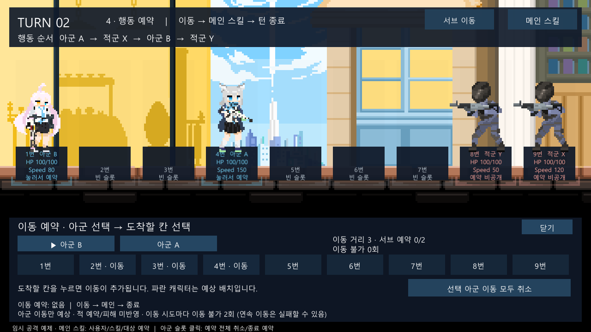

# 아군 교환 후 이동 불가 확인

2026-10-04 / 상태: **검토 완료(제보 확인 범위)** / 검토자: dayoff53

사용자가 재확인 후 문제가 없고 오해였다고 답변했다. 해당 제보는 종결한다. 이후 이동 금지 재시도의 디버프 처리 변경은 별도 [D-009 작업](2026-10-04-movement-lock-retry.md)이다.

## 확인 대상과 규칙

다른 유닛의 이동으로 자리가 바뀐 유닛도 이동 불가에 걸리는 것 같다는 제보를 확인했다. [규칙 원문](../reference/battle-rules-2026-09-23.txt) 14절은 교환당한 유닛에게 이 이유만으로 이동 불가를 부여하지 않으며, 본인이 예약한 이동을 시도하면 성공·실패와 무관하게 2회를 부여한다고 명시한다.

## 조사 결과

- 현재 `TurnBattle.Movement.cs`의 `TryMoveOneSlot`은 교환 상대의 좌표만 바꾼다. 이동 불가를 부여하는 `FinishMovement`는 이동을 직접 시도한 `actor`만 변경한다.
- A1/B2에서 A→4번만 실행하면 B는 1번으로 교환된다. 다음 턴 A의 이동 불가는 1회, B는 0회가 기대 결과다.
- B가 이동을 함께 예약하면 A에 의해 교환된 뒤 자기 차례에 이동할 수 있다. 이때 B에게도 이동 불가가 붙는 이유는 B 자신의 이동 시도다.
- 목적지 선택 제한은 상태와 별개다. 교환된 예상 출발점에서의 거리, 적 점유, 예약 횟수 한도도 버튼을 비활성화한다.
- 현재 이동 창의 아군 버튼은 **실제 슬롯 순서**다. 위 예시의 다음 턴에는 B가 첫 번째, A가 두 번째가 된다. 이는 확인된 UI 동작이며 사용자 제보의 원인이라고 확정하지 않았다.

사용자가 겪은 정확한 예약 조합과 턴은 아직 확인되지 않았다. 확인된 결과를 근거로 원래 전투 규칙이나 런타임 로직을 변경하지 않았다. 같은 증상을 추적할 수 있도록 규칙 테스트 2개와 실제 씬 테스트 1개를 추가했다.

## 검증

- EditMode **65/65 통과**. 교환 직후 같은 턴 자기 이동, 자기 이동 없는 다음 턴의 0회 유지 검사를 추가했다.
- PlayMode **7/7 통과**. 실제 Stage_Battle에서 A만 이동 → 다음 턴 B 선택 → `이동 불가 0회` 표시 → B→3번 예약/실행을 확인했다. B는 자기 이동을 한 뒤에만 다음 턴 이동 불가 1회가 되었다. [결과 요약](evidence/2026-10-04-movement-passenger-tests.json).
- 별도 `Logs/StageValidation` 사본, Unity `6000.5.10f1`에서 수행했다. 원본 에디터 직접 조작과 플레이어 빌드는 미실행이다.
- 런타임 코드와 비스크립트 리소스는 수정하지 않았다. 런타임 파일 해시를 작업 전후 비교했고 검증 사본의 Stage_Battle 씬도 원본과 일치했다.
- 이전 검증 사본의 Unity 자동 PlayerSettings 이행 차이와 Odin 초기화 예외/Missing Script 경고는 그대로 남는다. 이번 테스트 성공이 그 문제 해결을 뜻하지 않는다.

## 재현 확인 순서

1. Stage_Battle Play → 처음부터 → 서브 이동 → **아군 A → 4번**만 예약한다. B는 이동을 예약하지 않는다.
2. 창을 닫고 턴 넘기기를 누른다. A는 4번, B는 1번이다.
3. 다음 턴 이동 창에서 버튼 이름을 보고 **아군 B**를 선택한다. `이동 불가 0회`와 3번 목적지 선택 가능 여부를 확인한다.
4. B→3번을 예약하고 실행한다. 이번에는 B가 직접 이동했으므로 그다음 턴 B의 이동 불가는 1회다.

이와 다른 결과가 보이면 해당 턴 번호, 두 유닛의 예약 목적지/순서, 실제 이동 불가 숫자인지 목적지 버튼 비활성화인지가 추가 재현에 필요하다.
