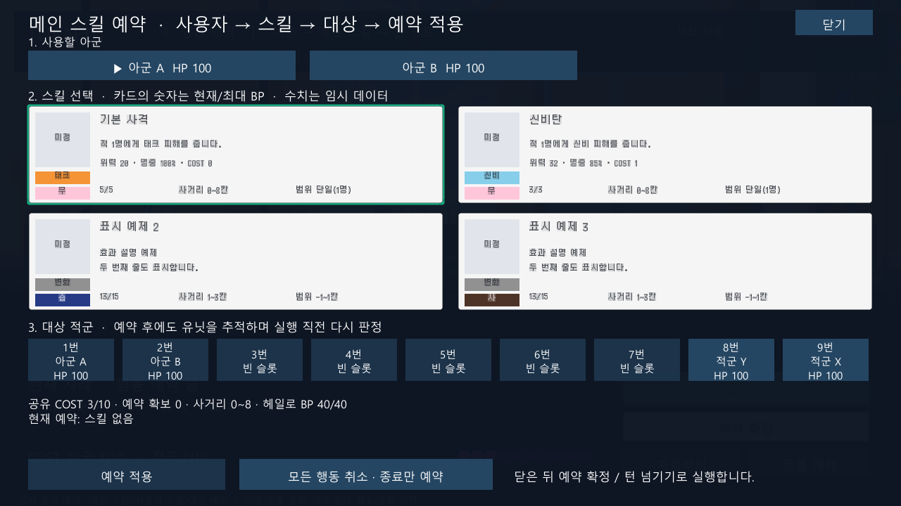
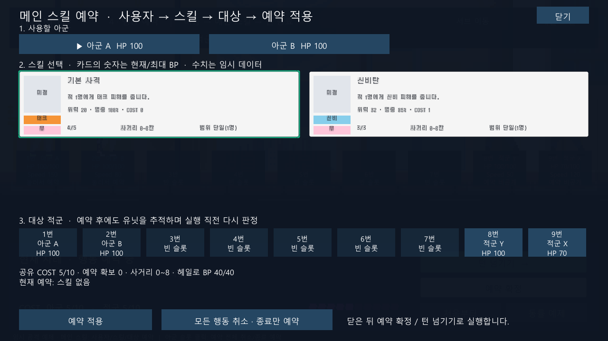

# SkillSlot 프리팹 데이터 표시

2026-10-04 / 상태: **검토 대기** / 검토자: dayoff53

## 변경 결과

사용자가 지정한 실제 경로는 `Assets/Resources/prefab/UI/SkillSlot.prefab`이다. 해당 프리팹에는 사용자의 미커밋 변경이 있어 원본 및 `.meta`를 유지하고 런타임 복제본에 새 표시 컴포넌트를 붙였다. 격리된 카브 스크립트는 연결하지 않는다.

`Stage_Battle`과 `TurnSandbox`의 메인 스킬 창이 기존 텍스트 버튼 대신 이 프리팹을 사용한다. 최대 4개의 카드를 두 열로 배치하고 선택 외곽선을 표시한다. 클릭 시 기존 스킬/대상 예약 흐름을 그대로 따른다.

| 프리팹 자식 | 데이터 |
| --- | --- |
| SkillNameText | 스킬 이름 |
| SkillFlavorText | `MainSkill.EffectDescription`. 생략하면 실제 단일 공격의 계열·위력·명중률·COST로 만든 효과 설명 |
| SkillCostText | 현재 BP/최대 BP. 예: `13/15`. 공유 COST와 구분 |
| SkillRangeText | 최소~최대 거리. 같은 값이면 한 값만 표시 |
| SkillAreaText | 현재 일반 공격은 `범위 단일(1명)`. 범위 공격이 구현된 것처럼 표시하지 않음 |
| SkillIcon | 이미지가 없으면 회색 영역에 `미정`. 지정하면 원본 비율 유지 |
| SkillType | 타입 이름과 배경색 |
| SkillTrait | 속성 이름과 배경색 |

다른 유닛/스킬을 선택하거나 스킬을 사용한 뒤 다시 창을 열면 최신 BP를 조회한다. 한 유닛의 BP가 다른 유닛 카드에 남지 않도록 매 갱신 시 전체 필드를 바꾼다.

## 색상

색 계열은 사용자 요청이고, 아래 RGB는 그 계열을 UI에서 표현하기 위해 선택한 구현 값이다. 어두운 배경에는 흰 글자, 밝은 배경에는 어두운 글자를 사용한다.

| 분류 | 이름 | 색 | RGB |
| --- | --- | --- | --- |
| 타입 | 태크 | 주황 | `#F59437` |
| 타입 | 신비 | 하늘 | `#87CEEB` |
| 타입 | 변화 | 회색 | `#919191` |
| 속성 | 염 | 주황 | `#F59437` |
| 속성 | 습 | 군청 | `#263A85` |
| 속성 | 전 | 청록 | `#24AAA5` |
| 속성 | 폭 | 빨강 | `#DA4141` |
| 속성 | 금 | 실버 | `#C0C0C0` |
| 속성 | 신 | 하늘 | `#87CEEB` |
| 속성 | 성 | 연노랑 | `#FFEF99` |
| 속성 | 암 | 보라 | `#844CB3` |
| 속성 | 순 | 연두 | `#B1DE69` |
| 속성 | 사 | 어두운 갈색 | `#4E3426` |
| 속성 | 무 | 연분홍 | `#FFC6DA` |

## 연결 방법과 파일

- [SkillSlotView.cs](../../Assets/MaseiKivotos/Unity/SkillSlotView.cs): 프리팹 필드 연결, TMP 텍스트, 색상, 아이콘, 선택 표시. `Bind`는 현재 전투의 일반 공격을 표시하고 `Show`는 임의 표시 데이터를 받아 변화 타입이나 범위 문구도 표현한다. 표시가 전투 효과 실행을 뜻하지는 않는다.
- [MainSkillPanel.cs](../../Assets/MaseiKivotos/Unity/MainSkillPanel.cs): `Resources.Load`로 원본을 읽고 최대 4장의 카드로 복제해 선택 콜백을 연결한다. 프리팹 이름은 유지하며 클릭을 자식 글자/이미지가 가로채지 않게 한다.
- [MainSkill.cs](../../Assets/MaseiKivotos/Core/MainSkill.cs): 선택적인 효과 설명을 추가했다. 기존 생성자는 변경 없이 동작한다. `SkillType.Change = 2`는 표시용으로 추가했고 기존 `Tech = 0`, `Mystic = 1`은 유지한다. 변화 효과를 일반 피해로 실행하지 않도록 현재 `MainSkill` 생성자는 변화 타입을 명시적으로 거부한다.
- TextMesh Pro 어셈블리 참조를 추가했다. 폰트는 프리팹의 기존 `Silver SDF`를 재사용한다. 원본 프리팹의 겹치는 글자 배치는 생성된 인스턴스에서만 카드 크기에 맞춘다.

스킬 이미지가 결정되면 **`Assets/Resources/SkillIcons/<스킬 ID>`** 경로에 Sprite 에셋을 두면 자동 연결된다. 예: `shot.png`, `mystic.png`를 `Sprite (2D and UI)`로 임포트한다. 이미지가 없는 스킬로 바뀌면 이전 스킬 이미지도 제거한다. 외부 표시에서 직접 이미지를 지정할 때는 `SkillSlotView.Show(..., icon: sprite)`를 사용할 수 있다.

## 검증 및 확인 순서

- Unity 사본에서 컴파일·**EditMode 67/67**, **PlayMode 10/10 통과**. 3타입·11속성 이름/색, 13/15와 0/5 BP 형식, 아이콘 지정/해제, 네 장 배치/클릭, 실제 스킬 사용 후 5/5→4/5 갱신을 확인했다. 기존 이동·스킬·헤일로·턴 진행 테스트를 포함한다.
- 최종 결과: `Logs/skill-slot-editmode.xml`, `Logs/skill-slot-playmode-final.xml` 및 대응 로그. [테스트·파일 해시 요약](evidence/2026-10-04-skill-slot-tests.json).
- 마키보 파일 63개는 사본과 해시 일치. SkillSlot 원본과 `.meta`, Stage_Battle 씬은 작업 시작 당시 해시를 보존했다. 코드/문서 공백과 문서 링크도 검사했다.
- Stage_Battle Play → 메인 스킬. 기본 사격/신비탄의 각 필드와 타입 배경색, 무 속성의 연분홍 배경을 확인한다.
- 기본 사격을 예약해 실행하고 다음 턴에 창을 다시 열면 `5/5`에서 `4/5`로 바뀐다.
- 테스트의 변화/광역 문구 카드와 13/15 예시는 표시 검증용이다. 전투 편성에 미구현 효과를 추가하지 않았다.
- 원본 에디터 직접 조작과 플레이어 빌드는 별도 검증 대상이다. 기존 검증 사본의 PlayerSettings 자동 이행 차이, Odin 초기화 예외/Missing Script 경고는 이 작업의 해결 범위가 아니다.

## 실제 렌더링 화면

네 장 배치 검증: 아래 두 장은 변화 타입·다른 속성 색·범위 문구를 확인하기 위한 표시 전용 예제다.

실제 기본 사격 사용 후 다음 턴의 `4/5` BP 표시:

