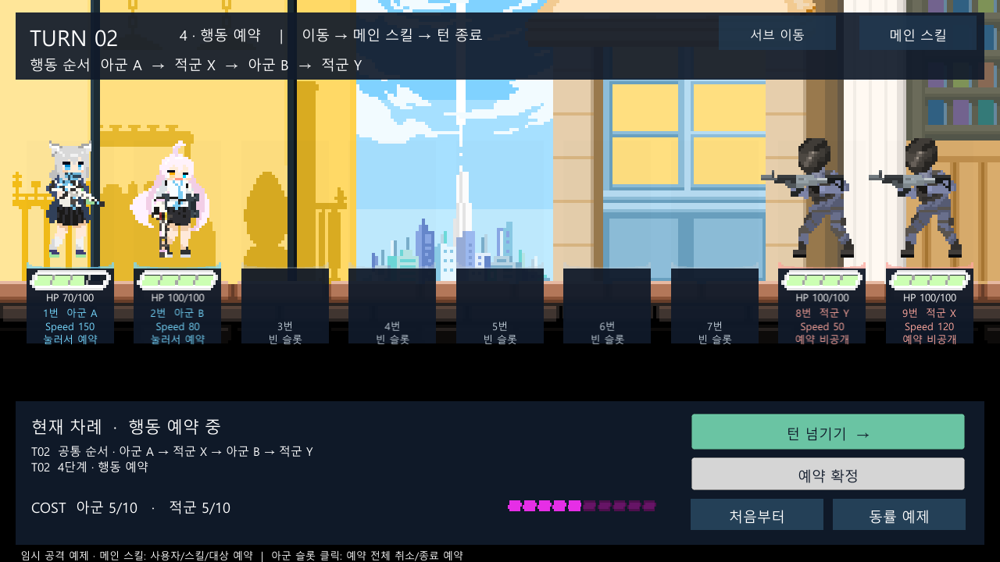
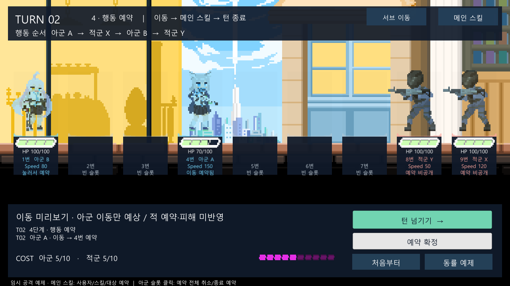
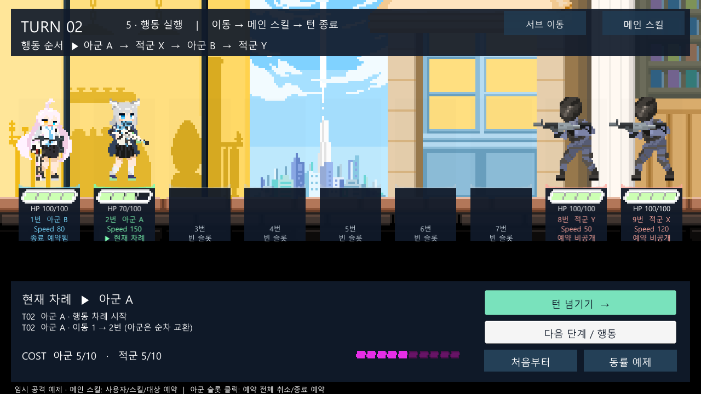

# 기존 슬롯 바닥과 HP 바의 UI 연결

2026-10-04 / 상태: **검토 대기** / 검토자: dayoff53

## 목적과 적용 범위

사용자 요청에 따라 `Stage_Battle`의 기존 `SlotGroundSprite`와 `UnitBase` 안의 `HpBarBackground`를 새 전투 UI에 연결한다. 씬의 `UnitBase`는 `Assets/Resources/prefab/Unit.prefab` 인스턴스 이름이다. 별도 `UnitBase.prefab` 에셋을 만들지 않는다.

전투 계산은 변경하지 않는다. 현재 HP는 Core의 `BattleUnit.CurrentHp`, 최대 HP는 `Definition.Stats.Hp`를 사용한다. HP 0의 퇴각은 규칙 원문 2절의 기존 처리 결과를 표시한다. 이동은 D-008에 따라 4단계 예상 배치와 5단계 실제 배치를 구분한다.

## 변경 결과

- `StageBattleView.Build`: 9개 슬롯의 `SlotGroundSprite.sprite`를 UI `Image`에 연결한다. 원래 월드 렌더러는 실행 중에만 숨겨 중복 표시를 막는다. 바닥 윤곽은 캐릭터 아래에서 빈 슬롯/아군/적군/현재 차례 색으로 표시한다.
- `BuildHpBar`: 기존 `UnitCanvas/HpBarBackground`와 자식 `HpBar`를 런타임 HUD로 옮긴다. 배경/채움 스프라이트와 원래 비율을 재사용하고, 구형 `ApBar`와 `HpText`는 해당 실행 인스턴스에서만 숨긴다. 정확한 `HP 현재/최대` 문구는 게이지 아래에 별도로 표시한다.
- `Refresh`: `DisplayedUnitAtSlot`으로 현재 보이는 유닛을 조회해 HP 비율/숫자를 함께 갱신한다. 피해·초기화가 즉시 반영되며 빈 슬롯과 퇴각한 자리에는 게이지와 HP 문구가 남지 않는다.
- 이동 예시에서 A/B가 바뀌면 각자의 HP도 따라간다. 예약 확정 직후 실제 배치로 되돌아가고, 이후 한 칸씩 실행할 때도 같은 방식으로 표시한다. 미리보기 자체는 피해나 회복을 예측하지 않는다.
- 슬롯 장식의 raycast를 끄고, 슬롯 UI 루트를 조작 버튼보다 뒤에 배치했다. 작은 Game 뷰에서 슬롯 영역이 턴 넘기기 버튼과 겹쳐도 조작 버튼이 우선 입력을 받는다.
- 함수·필드·내부 변수에 한국어 역할 주석을 추가했다.

프리팹·씬·스프라이트 에셋은 수정하거나 폐기하지 않았다. 카브 스크립트를 복구하지 않는다. 별도 규칙 검증용 `TurnSandbox`의 단순 카드 화면은 기존 표시를 유지한다.

## 검증

최종 실행 결과와 에셋 해시는 [증거 JSON](evidence/2026-10-04-unit-slot-hp-ui.json)에 기록한다. Unity `6000.5.10f1`의 별도 사본 `Logs/StageValidation`에서 실행했으며 원본 에디터 직접 조작과 구분한다.

- **컴파일 성공, PlayMode 11/11 통과** (`Logs/unit-hud-playmode-verified.xml`). 정적 `git diff --check` 통과.
- 작업 전후 원본 Unit/UnitSlot 프리팹·meta·Stage_Battle 씬 총 5개 해시 일치. `Assets/MaseiKivotos` 파일 65개는 검증 사본과 전부 일치했다.
- 첫 실행은 11/11 통과했으나 화면의 HP 위치를 내리는 과정에서 작은 Game 뷰의 조작 버튼을 슬롯이 가려 3개 테스트가 실패했다. 슬롯 UI를 조작 버튼 뒤로 배치한 최종 코드로 전체 11개를 다시 실행해 통과했다.

- 자동 PlayMode 검증: 원본 스프라이트 일치, HP 100→70과 70% 게이지, 빈 슬롯, 미리보기/실제 교환, 퇴각, 초기화, 실제 버튼 raycast.
- 화면 확인: 1280×720 캡처에서 바닥 윤곽, 캐릭터와 HP 바 간격, 수치, 감소한 게이지를 점검한다.
- Core 규칙은 변경하지 않았으며 이번에는 EditMode 규칙 테스트를 재실행하지 않는다. 플레이어 빌드와 원본 에디터의 수동 플레이도 미실행이다.
- 기존 Sirenix/Odin `MissingFieldException` 및 격리된 카브 참조의 Missing Script 경고는 남아 있다.

## dayoff53 확인 순서

1. `Assets/Scenes/Stage/Battle/BattleType/Stage_Battle.unity`를 열고 Play한다. 9칸 바닥 윤곽과 배치된 유닛의 `HP 100/100` 및 가득 찬 게이지를 확인한다.
2. **메인 스킬 → 아군 A → 기본 사격 → 적군 X → 예약 적용 → 닫기 → 턴 넘기기**. 적군 X가 `HP 70/100`이 되고 게이지가 70%로 줄어드는지 확인한다.
3. **서브 이동 → 아군 A → 4번 → 닫기**. 미리보기에서 A와 교환된 B의 HP가 각각 해당 이미지 아래에 붙는지 확인한다.
4. **예약 확정**으로 원래 배치에 돌아온 뒤 **한 단계 진행**을 반복한다. 실제 한 칸 이동마다 HP 표시도 따라가야 한다.
5. **처음부터**를 누르면 초기 배치와 HP가 복원된다. 빈 슬롯에는 HP 바가 없어야 한다.

## 검토 결과

dayoff53의 화면/동작 검토를 기다린다. 새로운 적 AI, 회복 스킬, HP 감소 애니메이션은 이번 범위에 포함하지 않았다.
