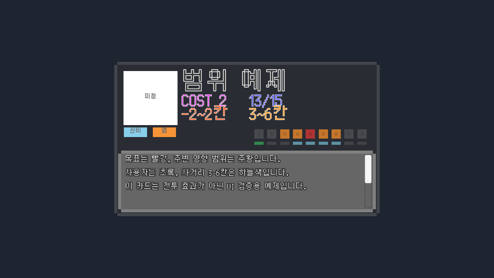
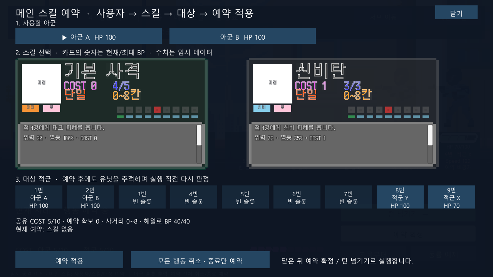

# SkillSlot 프리팹 편집과 범위·사거리 표시

2026-10-07 / 상태: **검토 대기** / 검토자: dayoff53

## 목적과 기준

dayoff53이 재구성한 SkillSlot의 배치와 스크롤 구조를 보존하고, 표시 데이터 연결과 9칸 도식을 추가한다. 원문 13절의 최소·최대 거리 포함, 목표 기준 상대 범위, 필드 밖 잘라내기를 표시 기준으로 사용한다. 전투 Core 규칙은 변경하지 않는다.

## 연결

| 프리팹 요소 | 데이터 |
| --- | --- |
| NameText | 스킬명 |
| CostText | 공유 COST 비용 |
| BpText | 소유자의 현재/최대 BP |
| RangeText | 최소~최대 사거리 |
| AreaText | 단일 또는 목표 기준 영향 범위 |
| IconText | Image: 스킬 이미지, 미지정 시 안내 문구 |
| TypeText | Image: 타입 색과 자식 TypeLabel의 타입명 |
| TraitText | Image: 속성 색과 자식 TraitLabel의 속성명 |
| FlavorTextBox/Scroll View/Viewport/Content/FlavorText | 스킬 효과 설명 |

현재 요청한 텍스트/이미지 이름은 이미 존재한다. IconText/TypeText/TraitText는 실제 컴포넌트가 Image이므로 이름을 유지하고 해당 역할로 연결한다. 필수 참조는 SkillSlotView에 직렬화해 이름 검색 없이 사용한다.

## 슬롯 계층과 외형

- 기존 중첩 인스턴스 StageMenu_AreaSlot 및 번호 복제본을 왼쪽부터 AreaSlot1~9로 정리하고 완전히 Unpack한다. 원본 AreaSlot.prefab 에셋은 유지한다.
- RangeSlot1~9를 각각 꺼내 Area&RangeSlots 직속 자식으로 옮긴다. 범위/사거리 이미지 모두 총 18개의 직속 자식이다.
- 기존 HorizontalLayoutGroup은 두 종류의 형제를 한 줄로 재배치하므로, 계산된 위치를 보존한 뒤 제거한다. 슬롯의 위치와 간격은 프리팹에서 직접 편집한다.
- 목표 5번은 빨강, 추가 영향 칸은 주황. 단일 대상은 5번만 빨강. 예: 범위 -2~2는 3·4·6·7번 주황, 5번 빨강.
- 사용자 1번은 초록. 사거리 3~6은 거리 3인 4번부터 거리 6인 7번까지 하늘색. 거리 0이 포함돼도 사용자 색이 우선한다.
- 비해당 칸은 반투명 회색. 재표시 시 이전 스킬의 색을 모두 초기화한다.
- Inspector의 Preview 값과 ‘슬롯 색상 미리보기’는 표시 예제다. 저장된 프리팹 예제는 사거리 3~6/범위 -1~1이며, 실행 시 실제 스킬 값으로 교체한다.

## 실행 연결

SkillSlotView는 크기·앵커·위치·폰트를 다시 지정하지 않는다. 스킬 창은 688×400 카드의 내부 배치를 유지하고 부모를 비율 축소하며, 카드 영역을 가로 스크롤한다. 설명 영역의 기존 ScrollRect 입력을 보존한다.

일반 MainSkill의 실제 실행은 현재 단일 공격이므로 Bind는 범위 0~0을 전달한다. 광역 도식은 숫자 오프셋을 받는 Show/ShowDiagram으로 표시할 수 있으나 일반 광역 공격을 새로 구현한 것은 아니다. 문구를 파싱해 도식을 추측하지 않는다.

## 검증

검증 사본: `Logs/SkillSlotValidation`. 원본 에디터와 별도로 실행한다.

- Unity 6000.5.10f1 사본에서 컴파일 성공, **PlayMode 12/12 통과**. 최종 XML: `Logs/skill-slot-playmode-verified.xml`, 로그: `Logs/skill-slot-playmode-verified.log`.
- 실제 씬의 카드 선택·스킬 예약·실행 후 BP 갱신, 기존 이동/턴 흐름, 3타입·11속성, 아이콘 지정/해제를 확인했다.
- 범위 -2~2, 단일, 필드 밖 범위 잘라내기, 사거리 0·3~6·8, 잘못된 구간, 이전 색 초기화, 18개 형제의 이름과 순서·가로 간격, 임의 수정한 위치/폰트 보존을 검사했다.
- 첫 렌더링에서 발견한 슬롯 중첩은 격리 프리팹의 HorizontalLayoutGroup 배치를 명시 계산한 뒤 분리하도록 수정했다. 수정 후 9칸 분리와 색상 표시를 캡처로 확인했다.
- 원본의 기존 일반 RectTransform 19개는 위치·크기·앵커·피벗·스케일·부모가 유지된다. 중첩 슬롯 18개는 기존 레이아웃 계산 후의 월드 네 모서리 좌표가 분리 전후 일치한다.
- SkillSlot GUID와 원본 AreaSlot.prefab 및 그 GUID를 보존했다. 사용자 씬·다른 프리팹·폰트·서드파티 변경을 덮어쓰지 않았다.
- Core를 수정하지 않아 EditMode 규칙 테스트는 재실행하지 않았다. 기존 코드의 경고는 남으며, 플레이어 빌드·원본 에디터 수동 조작은 미실행이다.
- 백업: `Logs/skill-slot-before`의 작업 시작 프리팹·meta와 관련 소스.
- 1회 이행 도구: `Tools/ConfigureSkillSlotPrefab.cs`. 사본의 Assets/Editor에 복사해 명시적으로 실행하며 자동 실행 코드는 없다.
- Unity 공식 API 참고: [LoadPrefabContents](https://docs.unity3d.com/6000.0/Documentation/ScriptReference/PrefabUtility.LoadPrefabContents.html), [UnpackPrefabInstance](https://docs.unity3d.com/6000.0/Documentation/ScriptReference/PrefabUtility.UnpackPrefabInstance.html).

## dayoff53 확인 순서

1. `Assets/Resources/prefab/UI/SkillSlot.prefab`을 연다.
2. Area&RangeSlots에서 AreaSlot1~9와 RangeSlot1~9가 별도의 직속 자식인지 확인한다.
3. 루트 SkillSlotView의 Preview Min/Max Range와 Preview Area Start/End를 바꾸고 도식 색상을 확인한다.
4. NameText 위치·크기 또는 슬롯 간격을 편집한 뒤 저장한다.
5. Stage_Battle → Play → 메인 스킬에서 편집한 내부 배치, COST/BP, 설명, 사거리/범위 도식을 확인한다.
6. 스킬 예약 후 실행하고 다음 턴에 BP 갱신을 확인한다.

## 남은 범위

- 다른 UI의 프리팹화는 이번 범위에 포함하지 않는다.
- 원본 에디터 수동 검토와 플레이어 빌드는 별도이며 dayoff53 검토 전 ‘검토 완료’로 표시하지 않는다.

## 실제 렌더링

광역/사거리 표시 전용 예제(실제 광역 스킬 추가가 아님):

실제 스킬 실행 후 BP 갱신:

