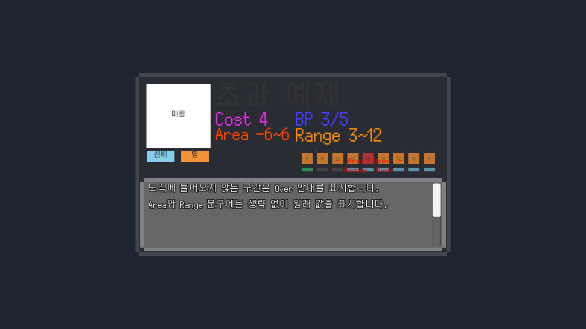
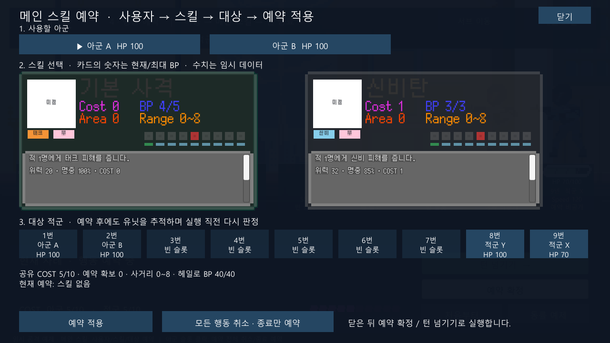

# SkillSlot 값 표기와 Over 안내

2026-10-08 / 상태: **검토 대기** / 검토자: dayoff53

## 요청과 변경

- 수치에 `Cost 4`, `BP 3/5`, `Area -1~1`, `Range 3~6` 접두어를 붙인다. BP는 기존 현재/최대 정보를 유지한다. 단일 범위는 `Area 0`, 같은 최소·최대 사거리는 `Range 3`으로 표시한다.
- Area 도식은 목표 5번을 중심으로 상대 오프셋 -4~4를 표현한다. 이 구간을 조금이라도 벗어나면 AreaOverText를 활성화한다.
- Range 도식은 사용자 1번 기준 거리 0~8을 표현한다. 최대 거리가 8을 넘으면 RangeOverText를 활성화한다.
- 정상 구간으로 돌아오면 해당 안내를 비활성화한다. 두 안내는 서로 독립적이다. 슬롯은 보이는 구간을 계속 표시하며 정확한 전체 구간은 AreaText/RangeText에 남긴다.
- 음수 사거리, 시작>끝 구간은 여전히 잘못된 데이터로 거부한다. 표시 전용 API에서 거리 9 이상을 받아 안내할 수 있게 했지만, 실제 전투 MainSkill의 0~8 제한과 Core 규칙은 변경하지 않는다.

## 뒤에 보인 원인

사용자가 추가한 두 OverText는 `TextMeshPro + MeshRenderer`인 3D 글자였다. 슬롯 Image는 Canvas에서 그려지는 UI이므로 같은 UI 형제 순서로 합성되지 않았다. 또한 Area&RangeSlots의 자식 순서도 OverText 둘 → AreaSlots → RangeSlots여서 UI로만 전환해도 슬롯이 나중에 그려지는 구조였다.

- 같은 오브젝트를 `TextMeshProUGUI + CanvasRenderer`로 전환한다.
- 부모의 마지막 형제로 옮겨 `AreaSlots → RangeSlots → AreaOverText → RangeOverText` 순서로 저장한다.
- 기존 문구·폰트·색·위치·스케일을 보존한다. 3D 텍스트의 크기를 UI 단위로 변환하고, 크기가 0×0이던 두 안내에 행 영역을 지정해 자동 글자 크기를 적용한다.
- 안내의 Raycast Target은 꺼서 스킬 선택을 가로채지 않게 한다.
- 사용자가 새로 묶은 AreaSlots/RangeSlots 계층과 각 슬롯 배치는 보존한다.
- 접두어 추가 후 Area/Range가 겹치는 것을 렌더링에서 확인했다. 기존 값 텍스트 4개가 모두 0×0 영역에서 넘침 표시를 사용한 것이 원인이다. 위치·색·폰트를 보존하고 네 텍스트에 열 너비/행 높이와 자동 글자 크기를 프리팹 설정으로 부여했다. 런타임 코드가 배치를 덮어쓰지는 않는다.

## 에디터 편집

SkillSlotView의 Inspector에서 Preview Min/Max Range와 Preview Area Start/End를 수정하면 문구와 도식, Over 활성 상태가 함께 갱신된다. 이전 슬라이더 상한을 제거해 사거리 9 이상도 미리 볼 수 있다. 이 값은 편집용 예제이며 전투 데이터는 바꾸지 않는다. Undo가 안내 GameObject 활성 상태도 복구하도록 보완했다.

## 검증

- Unity 6000.5.10f1 검증 사본에서 컴파일 성공, **PlayMode 13/13 통과**. 최종 XML: `Logs/skill-slot-over-playmode-verified.xml`.
- 초과 경계(-4~4/0~8), 좌·우 일부 초과, 전체 초과, 두 안내의 독립 활성화, 정상 복귀 시 숨김, 접두어, 실제 BP 갱신을 확인했다.
- 실제 CanvasRenderer의 깊이로 두 안내가 모든 슬롯보다 나중에 그려지는 것을 확인했다. 일반/초과 렌더링을 확인했고 Area/Range의 글자 폭이 각 표시 영역 안에 들어오는 것도 검사했다.
- 원본의 44개 RectTransform 중 위치·앵커·피벗·스케일·부모 변경은 없다. 크기 변경은 값 텍스트 4개와 OverText 2개의 0×0 표시 영역을 보완한 것뿐이다. OverText의 형제 순서 변경은 의도한 그리기 순서 수정이다.
- 원본 적용 파일과 검증 사본 해시 일치, SkillSlot GUID 유지. [검증 요약](evidence/2026-10-08-skill-slot-overflow.json).
- 사본: `Logs/SkillSlotValidation`.
- 시작 백업: `Logs/skill-slot-over-before`.
- 명시적 1회 이행 도구: `Tools/ConfigureSkillSlotOverflow.cs`.
- Core 미변경. EditMode 규칙 테스트와 플레이어 빌드는 이번에 실행하지 않는다.
- 원본 에디터의 수동 조작은 미실행이다. 컴파일의 기존 구형 코드 경고는 별도로 남는다.

## dayoff53 확인 순서

1. SkillSlot 프리팹 루트에서 `슬롯 색상 미리보기`를 누른다.
2. Area -4~4 / Range 0~8: 두 OverText가 모두 꺼져야 한다.
3. Area -5~4 / Range 0~8: AreaOverText만 켜져야 한다.
4. Area -4~4 / Range 3~9: RangeOverText만 켜져야 한다.
5. Area -6~6 / Range 3~12: 두 문구가 슬롯보다 앞에 보여야 한다.
6. Area -1~1 / Range 3~6으로 되돌리면 두 문구가 꺼져야 한다.
7. Stage_Battle → 메인 스킬에서 실제 Cost/BP/Area/Range 표시와 실행 후 BP 갱신을 확인한다.

## 실제 렌더링

초과 시 두 안내가 슬롯 앞에 표시되는 예제:

정상 범위에서 안내가 숨겨지고 실제 BP가 갱신된 상태:

